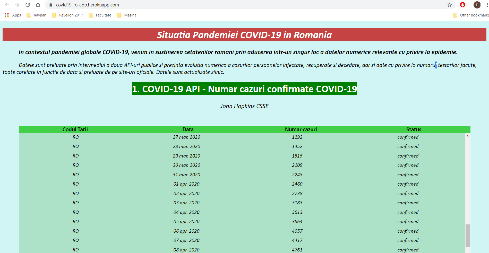
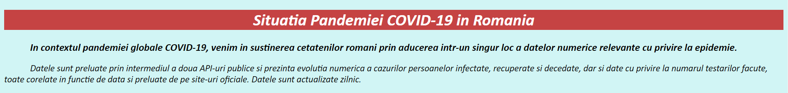
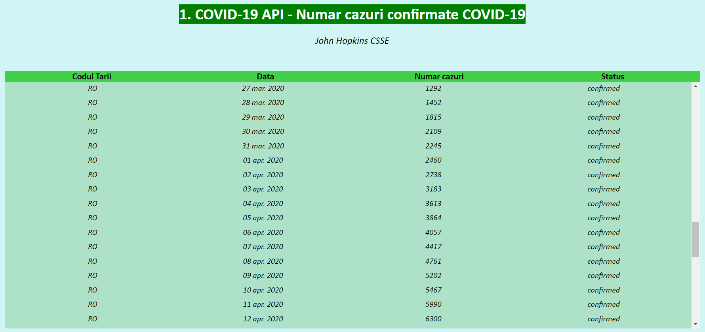
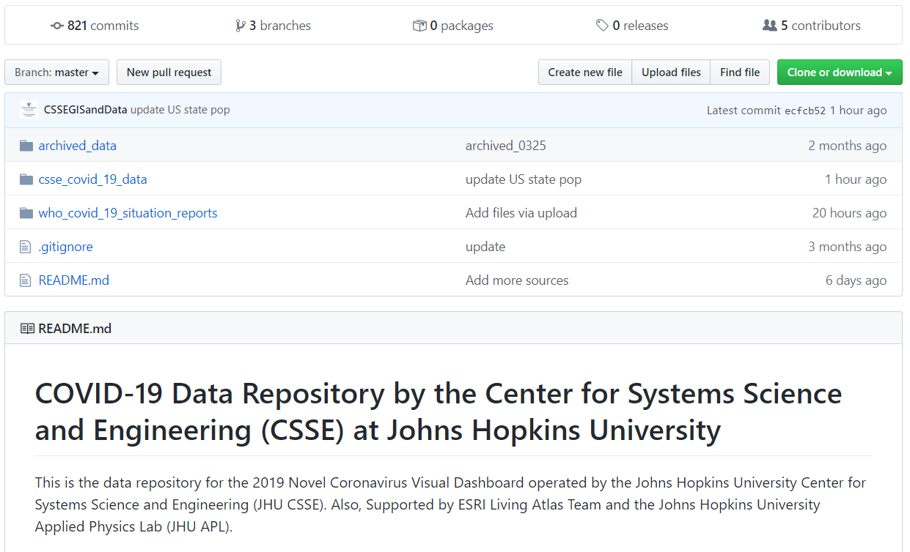
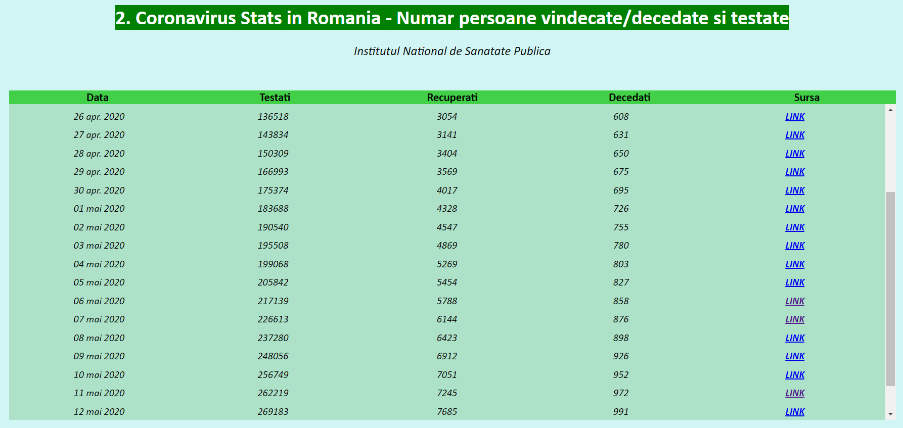
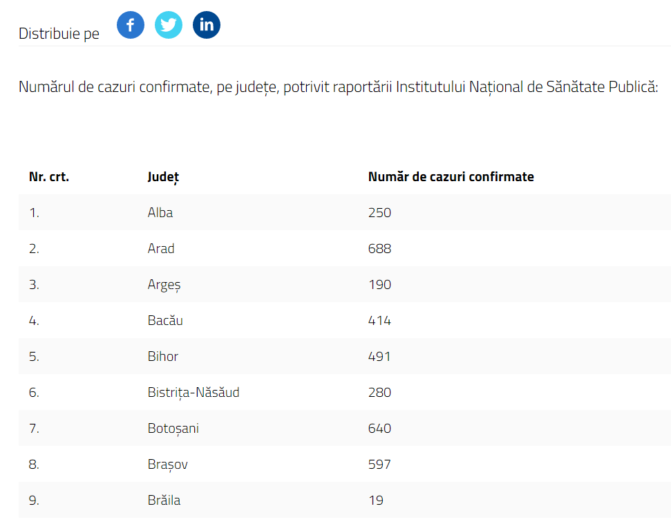
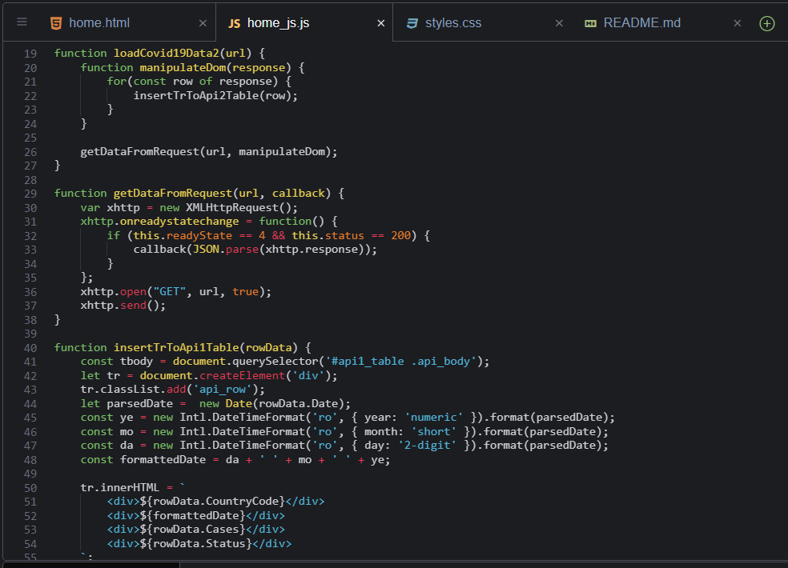

# COVID-19 RO APP
## Aplicatie ce inglobeaza date numerice legate de impactul COVID-19 asupra Romaniei, actualizate in timp real 
### Documentatia aplicatiei

#### 1. Introducere

Aplicatia WEB utilizeaza limbajele HTML, JavaScript si CSS pentru a proiecta in user interface datele preluate prin intermediul a doua API-uri.

Termenul de API este acronimul de la Application Programing Interface care in limba română se poate traduce ca interfață de programare a aplicațiilor și reprezinta un set de reguli și specificații cu ajutorul cărora un program poate accesa și folosi resursele oferite de un alt program. Cu alte cuvinte, un program care oferă API-uri permite altor programe să interacționeze cu acesta automat, de la program la program sau de la program la sistem de operare, fără să fie nevoie de folosirea unei interfețe grafice de utilizare (GUI) și fără cunoștințe legate de arhitectura sau elemente de programare ale programului ci doar folosirea specificațiilor de utilizare a API-ului oferit.

REST este un stil de arhitectură pentru sistemele informatice aflate într-o rețea si termenul complet este Representational State Transfer.

#### 2. Descriere problema

Cu totii cunoastem pandemia globala de **coronaviroza COVID-19** in care ne aflam, motiv pentru care aceasta reprezinta unul dintre cele mai importante subiecte pe plan mondial. Este esential sa fim la curent cu evolutia acestei pandemii si consider ca este o responsabilitate morala ca fiecare persoana sa respecte prevederile Institutiilor de Sanatate Publica si a Organizatiei Mondiale a Sanatatii pentru a ii proteja pe cei din jurul nostru, si nu in ultimul rand pe noi insine.

Un aspect ce poate fi observat in perioada aceasta este faptul ca solutiile IT sunt folosite la potential maxim pentru ca activitatile sa se poata desfasura in continuare in ritm cat se poate de normal. De aceea, consider ca in aceasta situatie de criza trebuie sa valorificam toate resursele IT de care dispunem si sa punem intr-o lumina pozitiva comunitatea dezvoltatorilor care fac eforturi pentru ca oamenii sa poata trece mai usor peste aceasta perioada.

Astfel, in contextul pandemiei globale COVID-19, o solutie pe care o consider benefica pentru oameni ar fi crearea unei aplicatii WEB care sa aduca intr-un singur loc date numerice relevante cu privire la raspandirea virusului SARS-CoV-2. Aplicatia preia datele prin intermediul a doua API-uri publice.

#### 3. Descriere API

Infrastructura proiectului este constituita dintr-o aplicatie WEB ce inglobeaza HTML, JavaScript si CSS si se bazeaza pe doua API-uri publice care ofera date relevante despre COVID-19 sub forma unor JSON-uri.

Concret, in realizarea aplicatiei au fost utilizate 2 API-uri. Am considerat ca utilizarea a doua API-uri va oferi aplicatiei un plus de certitudine in privinta datelor, acestea fiind corelate din doua surse diferite, una pe **pe plan mondial** iar cealalta cu provenienta **nationala**.

**I) COVID-19 API**

Link: https://covid19api.com/

Acesta este un API gratuit care permite accesarea datelor legate de Coronavirus, iar datele sunt colectate din sursa *https://github.com/CSSEGISandData/COVID-19*. Johns Hopkins University este de altfel renumita la nivel mondial in special pentru harta interactiva "COVID-19 Dashboard by the Center for Systems Science and Engineering" *https://coronavirus.jhu.edu/map.html*. Aceasta platforma furnizeaza date verificate cu privire la **numarul persoanelor infectate, numarul persoanelor vindecate si numarul persoanelor decedate** la nivel global, pe tara, ori in functie de alte criterii. 

API-ul este vast, are o documentatie clara si usor de parcurs (https://documenter.getpostman.com/view/10808728/SzS8rjbc?version=latest) impreuna cu toate rutele API-ului (https://api.covid19api.com/) iar endpoint-urile sunt numeroase. Printre acestea se afla variantele de a: obtine un sumar al cazurilor noi de COVID-19, decese si vindecari, la nivel global, ori pe tara; toate datele de mai sus expuse pentru o anumita tara, in functie de data, pornind de la prima data a identificarii virusului la nivel mondial, ori pornind de la prima data a identificarii virusului la nivel national si multe altele. Lista completa a endpoint-urilor este in documentatie.

Datele prezente in aplicatie ***(https://covid19-ro-app.herokuapp.com/)*** sunt obtinute printr-un GET by Country care imi returneaza toate cazurile confirmate/vindecate/decedate, de la prima zi a aparitiei COVID-19. Am selectat doar datele relevante din JSON si anume codul tarii (pentru referinta), data la care au fost identificate cazurile si numarul cazurilor confirmate. Coloana de *status* indica faptul ca numarul reprezinta cazurile confirmate.

**II) Coronavirus Stats in Romania**

Link: https://apify.com/vanadragos/covid-19-romania

Acesta este un API gratuit care permite accesarea datelor legate de Coronavirus, iar datele sunt colectate din sursa *https://stirioficiale.ro/informatii*. Stirioficiale.ro este un site demarat de Guvernul Romaniei, in parteneriat cu Code for Romania pentru ca oamenii sa acceseze mai usor informatiile despre COVID-19. Site-ul este actualizat zilnic, asadar si datele API-ului sunt updatate de la o zi la alta.

Datele prezente in aplicatie ***(https://covid19-ro-app.herokuapp.com/)*** sunt obtinute printr-un GET al fisierului JSON care ne returneaza informatiile dorite. Acestea sunt mai specifice decat cele oferite de primul API, pentru ca putem extrage si numarul de persoane testate, dar si sursa din care acestea provin. De aceea, am selectat doar datele relevante din JSON si anume data la care au fost identificate cazurile, numarul persoanelor testate, recuperate si decedate, dar si link-ul sursa al informatiei pentru fiecare linie, in cazul in care utilizatorul doreste sa vizualizeze buletinul de informatii.

#### 4. Flux de date

##### Exemple de request / response

In ceea ce priveste primul API - prin utilizarea metodei GET si inserarea in tabel a campurilor "CountryCode", "Date", "Cases", "Status" am primit ca response codul tarii analizate (in situatia noastra - RO), "date" reprezentand data actualizarii datelor pe care am formatat-o in asa fel incat sa afiseze ziua + luna + anul, luna fiind in limba romana, "cases" - reprezinta numarul de cazuri confirmate iar "status" reprezinta statusul cazurilor, deoarece API-ul poate intoarce si numarul persoanelor vindecate, ori decedate. Am considerat ca acestea sunt datele cele mai relevante pe care utilizatorul doreste sa le vada la prima accesare a paginii (primul API afiseaza datele deasupra celui de-al doilea.

Request-ul este realizat prin: https://api.covid19api.com/country/romania/status/confirmed

Exemplu JSON:
```
{
    "Country": "Romania",
    "CountryCode": "RO",
    "Province": "",
    "City": "",
    "CityCode": "",
    "Lat": "45.94",
    "Lon": "24.97",
    "Cases": 15588,
    "Status": "confirmed",
    "Date": "2020-05-11T00:00:00Z"
  },
  {
    "Country": "Romania",
    "CountryCode": "RO",
    "Province": "",
    "City": "",
    "CityCode": "",
    "Lat": "45.94",
    "Lon": "24.97",
    "Cases": 15778,
    "Status": "confirmed",
    "Date": "2020-05-12T00:00:00Z"
  },
```
In ceea ce priveste al doilea API - prin utilizarea metodei GET si inserarea in tabel a campurilor "date", "tested", "recovered", "sourceUrl" am primit ca response - "date" reprezentand data actualizarii datelor, pe care am formatat-o in asa fel incat sa afiseze ziua + luna + anul, luna fiind in limba romana, "tested" - reprezinta numarul de persoane testate, "recovered" reprezinta numarul persoanelor vindecate, iar "sourceUrl" ne intoarce link-ul cu sursa de unde au fost prealuate datele. Am considerat ca acestea sunt datele complementar relevante pe care utilizatorul doreste sa le vada la prima accesare a paginii (al doilea API afiseaza datele sub primul).

Request-ul este realizat prin: https://api.apify.com/v2/datasets/n1XtXTelVG5dJhDhy/items?format=json&clean=1

Exemplu JSON:

```
{
  "infected": 15778,
  "tested": 269183,
  "recovered": 7685,
  "deceased": 991,
  "country": "Romania",
  "historyData": "https://api.apify.com/v2/datasets/n1XtXTelVG5dJhDhy/items?format=json&clean=1",
  "sourceUrl": "https://stirioficiale.ro/informatii/buletin-de-presa-12-mai-2020-ora-13-00",
  "lastUpdatedAtSource": "2020-05-12T13:00:00.000Z",
  "lastUpdatedAtApify": "2020-05-12T10:00:00.000Z",
  "README": "https://apify.com/vanadragos/covid-19-romania"
},
{
  "infected": 16002,
  "tested": 277804,
  "recovered": 7961,
  "deceased": 1016,
  "country": "Romania",
  "historyData": "https://api.apify.com/v2/datasets/n1XtXTelVG5dJhDhy/items?format=json&clean=1",
  "sourceUrl": "",
  "lastUpdatedAtSource": "2020-05-13T13:00:00.000Z",
  "lastUpdatedAtApify": "2020-05-13T09:55:00.000Z",
  "README": "https://apify.com/vanadragos/covid-19-romania"
}
```
##### Metode HTTP

Metoda utilizata pentru preluarea datelor prin intermediul ambelor API-uri este GET care solicita datele din resursa specificata, reprezentata de URL.

La primul API a fost nevoie de modificarea endpoint-ului API pentru a returna datele de interes.

```
https://api.covid19api.com/country/<TARA_ALEASA>/status/<CONFIRMED/DEATHS/RECOVERED>
```

unde tara aleasa trebuie sa fie una dintre

```
https://api.covid19api.com/countries
```
iar status-ul trebuie sa fie unul dintre cele 3: confirmed/deaths/recovered.

##### Autentificare si autorizare servicii utilizate (daca este cazul)

API-ul **Coronavirus Stats in Romania** este host-uit pe site-ul apify.com care contine o librarie de API-uri si permite crearea unor actori care sa lucreze cu acest API. Pentru a putea beneficia de toate avantajele este nevoie de un cont APIFY care ofera o cheie de autentificare ce poate fi utilizata pentru a accesa anumite endpoint-uri ale API-ului.

#### 5. Capturi de ecran aplicatie

##### Home Page



##### Header



##### COVID-19 API



##### Sursa 1 - John Hopkins CSSE



##### Coronavirus Stats in Romania API



##### Sursa 2 - stirioficiale.ro



##### Secventa Cod


